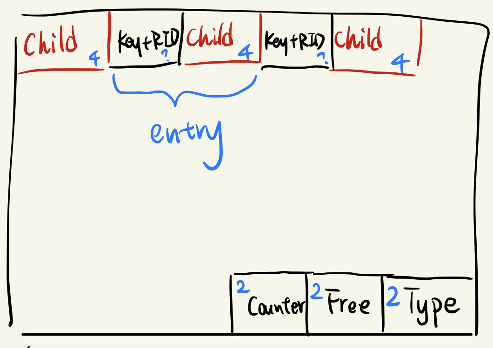
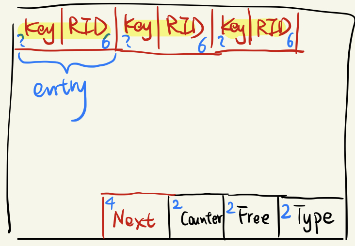

## Project 3 Report

### 1. Basic information
 - Team #: Dongjue Zu
 - Github Repo Link: https://github.com/UCI-Chenli-teaching/cs222p-winter22-BrandonZu
 - Student 1 UCI NetID: 3256 9266
 - Student 1 Name: Dongjue Zu

### 2. Meta-data page in an index file
- Show your meta-data page of an index design if you have any. 

There is one hidden page, which is the first page, in each index file.
This hidden page contains three counters, i.e. ixReadPageCounter, ixWritePageCounter, ixAppendPageCounter, and the page number of the root page. \
The format is as below:

| ixReadPageCounter | ixWritePageCounter | ixAppendPageCounter | RootPagePointer |
|-------------------|--------------------|---------------------|-----------------|
| 4 bytes           | 4 bytes            | 4 bytes             | 4 bytes         |

### 3. Index Entry Format
- Show your index entry design (structure). 

- entries on internal nodes:  

| Key     | RID page num | RID slot num | Child Page Pointer |
|---------|--------------|--------------|--------------------|
| ? bytes | 4 bytes      | 2 bytes      |  4 bytes           |

- entries on leaf nodes:

| Key     | RID page num | RID slot num |
|---------|--------------|--------------|
| ? bytes | 4 bytes      | 2 bytes      |

### 4. Page Format
- Show your internal-page (non-leaf node) design.

Each non-leaf page contains a page type(2 bytes), a pointer points to the start of free space(2 bytes) and an entry counter(2 bytes). \
This metadata is stored in the end of the page. \
In order to support duplicate keys across multiple pages, the key of entries is a composite key, which is made up of a key and the corresponding RID. \
The key and child pointer are staggered. The number of child page pointer is one more than the number of key.

- Show your leaf-page (leaf node) design.

Each non-leaf page contains a page type(2 bytes), a pointer points to the start of free space(2 bytes), an entry counter(2 bytes) and a pointer points to the next leaf page(4 bytes). \
This metadata is stored in the end of the page. \
Each entry is made up of a key and a RID.

### 5. Describe the following operation logic.
- Split

1. Non-leaf Node \
   * Append a new page
   * Push up the middle key
   * Move data to new page and set metadata
   * Compact old page and update metadata
   * Insert new entry into old page or new page

2. Leaf Node \
   * Append a new page
   * Find the start position of the data needed to move
   * Move data to the new page and set metadata
   * Compact old page and update metadata
   * Insert new leaf page into the leaf page linked list
   * Insert new entry into old page or new page
   * Copy up the middle key

- Rotation (if applicable)

Not applicable.

- Merge/non-lazy deletion (if applicable)

Not applicable.

- Duplicate key span in a page

Use composite key <key, rid> as the identifier in leaf pages

- Duplicate key span multiple pages (if applicable)

Use composite key <key, rid> in non-leaf pages

### 6. Implementation Detail
- Have you added your own module or source file (.cc or .h)? 
  Clearly list the changes on files and CMakeLists.txt, if any.

/src/ix/IXFileHandle.cc
/src/ix/IXPageHandle.cc
/src/ix/IndexPageHandle.cc
/src/ix/LeafPageHandle.cc
/src/ix/IXScanIterator.cc

- Other implementation details:

Declare three page handle classes
1. IXPageHandle
2. IndexPageHandle
3. LeafPageHandle

IndexPageHandle and LeafPageHandle are derived from IXPageHandle.
These page handles provides all operations needed. I operate the pages via these page handles.

### 7. Member contribution (for team of two)
- Explain how you distribute the workload in team.

Did all the work on my own.

### 8. Other (optional)
- Freely use this section to tell us about things that are related to the project 3, but not related to the other sections (optional)

I think the workload is too heavy for one person. I spent at least 60 hours coding in CLion, based on the statistic generated by a time management plugin, let alone the design process. \
The total time I spent on this project may add up to 70 hours. This is too much for one person to finish the project. Even though I have stayed up late many times, I still need to use the grace period.

- Feedback on the project to help improve the project. (optional)

Could give more instructions on the design. For example, declare a pageHandle.